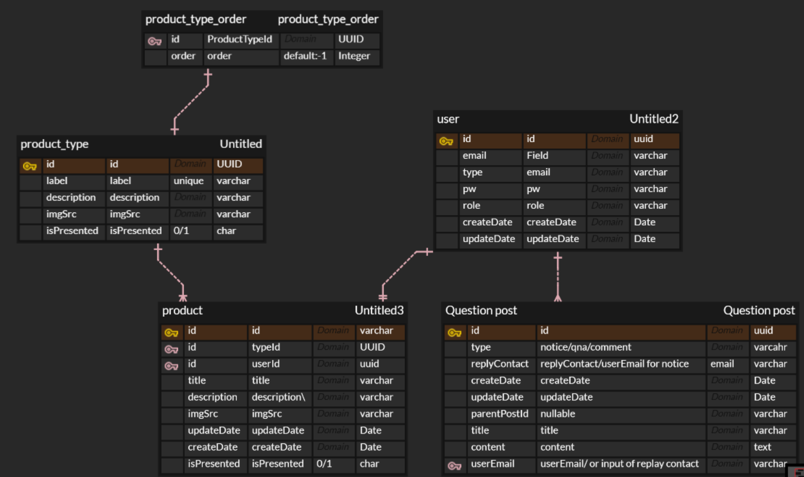

# HI-JEWEL SERVER

_[HI JEWEL URL](https://hi-jewel.netlify.app/)_

_[FRONTEND REPO](https://github.com/chanwoong528/hi_jewel_client)_

### ⚒️ Stack

- dev -> expressJS + Typescript(partial) + Sequelize + postgres + jest(soon) + nodemon
- deploy -> Railway (saas) => AWS(lambda) to be migrated soon
- storage(img): imgBB => AWS(S3/cloudFront) will be migrated soon
- communication: Swagger (soon)

### 📚 Library

- main
  - "axios": "^1.6.7",
  - "bcrypt": "^5.1.1",
  - "cookie-parser": "^1.4.6",
  - "cors": "^2.8.5",
  - "dotenv": "^16.3.1",
  - "express": "^4.18.2",
  - "express-validator": "^7.0.1",
  - "jsonwebtoken": "^9.0.2",
  - "multer": "^1.4.5-lts.1",
  - "pg": "^8.11.3",
  - "pg-hstore": "^2.3.4",
  - "sequelize": "^6.33.0"
- dev
  - "nodemon": "^3.0.1",
  - "swagger-jsdoc": "^6.2.8",
  - "swagger-ui-express": "^5.0.0",

## 📂 Folder Structure

```
project
│   README.md
└─── src
│   └─── config   (postgres, swagger setting)
│   └─── Model   (models Setting using Sequelize)
|        └─── postgres
│   └─── controller
│   └─── service
│   └─── util
|        └─── common   (MiddleWare/ authUtil[hashPw/decrypt, etc] / commonUtil)
|        └─── CONSTANT
|                 ERROR_CODE.ts (Error Types)
|                 RESPONSE_CODE (response by HTTP type[post,get,...])
|        └─── exceptions
└                 CustomError Class

```

## 🏓 ERD Tables


